# 并发编程

## 栈与栈帧
Java Virtual Machine Stacks (Java 虚拟机栈)
我们都知道 JVM 中由堆、栈、方法区所组成，其中栈内存是给谁用的呢?其实就是线程，每个线程启动后，虚拟 机就会为其分配一块栈内存。
- 每个栈由多个栈帧(Frame)组成，对应着每次方法调用时所占用的内存 
- 每个线程只能有一个活动栈帧，对应着当前正在执行的那个方法
- 栈帧的信息包括：局部变量、操作栈、返回地址等，（主要是一些寄存器信息）

## 线程上下文切换(Thread Context Switch)
因为以下一些原因导致 cpu 不再执行当前的线程，转而执行另一个线程的代码
- 线程的 cpu 时间片用完
- 垃圾回收
- 有更高优先级的线程需要运行
- 线程自己调用了 sleep、yield、wait、join、park、synchronized、lock 等方法
当 Context Switch 发生时，需要由操作系统保存当前线程的状态，并恢复另一个线程的状态，Java 中对应的概念 就是程序计数器(Program Counter Register)，它的作用是记住下一条 jvm 指令的执行地址，是线程私有的
- 状态包括程序计数器、指令寄存器，ebp、esp等描述线程状态的寄存器
-  Context Switch 频繁发生会影响性能

## wait、notify
### 工作原理
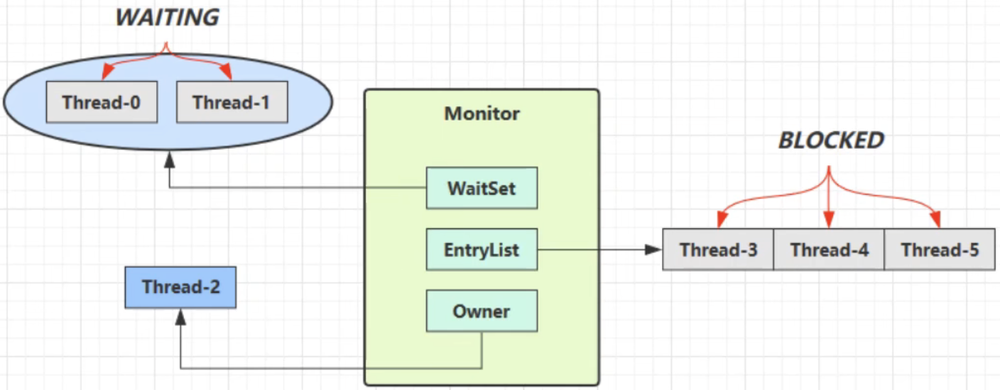
- Owner线程执行过程中发现某运行条件不满足，主动调用wait方法，即可进入WaitSet变为WAITING状态
- BLOCKED和WATING的线程都处于阻塞状态，不占用cpu
- BLOCKED线程会在Owner线程释放锁时，争夺锁被唤醒
- WATING线程会在Owner线程调用notify或者notifyAll时唤醒，但唤醒后并不意味着立马获得锁，仍需要进入EntryList重新竞争

### api介绍
- obj.wait()让进入object监视器的线程到WaitSet等待; WaitSet 可以存在多个等待线程
- obj.notify()在obj上正在WaitSet等待的线程中挑一个唤醒
- obj.notifyAll()让在obj上正在WaitSet等待的线程全部唤醒
注意：必须获得了此对象obj的对象锁后才能调用以上方法！也就是必须成为了monitor的Owner才有资格调用以上方法！

### sleep(Long)和wait(Long)的异同
- sleep是Thread的方法，而wait是Object的方法
- sleep不需要强制和synchronized搭配使用，但wai必须和synchronized一起使用
- sleep在睡眠时不会释放对象锁，但wait在等待的时候会释放对象锁
- 二者被调用后，线程都会进入到TIME_WATING状态

```java
// wait建议的使用方法
synchronized(lock) {
    while(条件不成立) { // 使用while而不是if，是为了防止被错误叫醒
        wait();
    }
    // work...
}

// 另外一个线程使用notifyAll来唤醒
synchronized(lock) {
    lock.notifyAll();
}
```

### LockSupport.pack()、LockSupport.unpack(Thread) 与 Object的wait()、notify、notifyAll()的区别
- wait、notify和notifyAll必须配个Object Monitor一起使用，而park、unpark不必
- park和unpark是以线程为单位进行阻塞或唤醒线程，而notify是随机唤醒一个waiting状态的线程，notifyAll唤醒所有等待的线程，不是那么精确
- park和unpark可以先执行LockSupport.unpark（假如unpark(thread_t)先执行了，后续执行LockSupport.pack()时执行，thread_t不会进入阻塞状态，立马继续运行）；而wait和notify无这种特性
- park也可以被interrupt，但是park被interrupt后不会清除线程的打断标志

### 问题
1. 被notify唤醒的线程再次获得锁后，是直接从wait语句的下一行代码开始执行吗？
    答案：是的，会从wait的下一句开始执行。

## ReentrantLock
ReentrantLock相对于synchronized有如下优点：
- 可中断
- 可以设置超时时间
- 可设置为公平锁( syncronized 是不公平的，当 monitor 的 owner 释放锁时，阻塞队列中的线程谁抢到锁，谁就运行，而不是按照进入阻塞队列的顺序获得锁)，ReentrantLock默认是不公平锁，可通过构造方法 ReentrantLock(true) 设置为公平锁
- 支持多个条件变量

ReentrantLock于synchronized一样可重入(即可对同一线程多次加锁)

### ReentrantLock基本语法
```java
// 获取锁
reentrantLock.lock();  // reentrantLock是一个程序员创建的ReentrantLock对象
try {
    // 临界区
    // work to do
} finally {
    // 释放锁
    reentrantLock.unlock();
}
```

### 条件变量
synchronized 中也有条件变量，就是 monitor 的那个 waitSet 休息室，当条件不满足时进入 waitSet 等待 ReentrantLock 的条件变量比synchronized 强大之处在于，它是支持多个条件变量的，这就好比
- synchronized 是那些不满足条件的线程都在一间休息室等消息
- 而 ReentrantLock 支持多间休息室，有专门等烟的休息室、专门等早餐的休息室、唤醒时也是按休息室来唤醒

使用要点:
- await 前需要获得锁
- await 执行后，会释放锁，进入 conditionObject 
- 等待 await 的线程被唤醒(或打断、或超时)重新竞争 lock 锁 
- 竞争 lock 锁成功后，从 await 后继续执行

```java
// api简要介绍
ReentrantLock lock = new ReentrantLock();

// 获取一个条件变量
Condition condition1 = lock.newCondition();
Condition condition2 = lock.newCondition();  // 可获取多个条件变量

condition1.await();  // 等待

condition1.signal();  // 唤醒一个等待condition1的线程
condition1.signalAll();  // 唤醒所有等待condition1的线程
```

## JMM
Monitor 主要关注的是访问共享变量时，保证临界区代码的【原子性】
通过对JMM的学习进一步深入学习共享变量在多线程间的【可见性】问题与多条指令执行时的【有序性】问题

JMM 即 Java Memory Model，它定义了主存、工作内存抽象概念，底层对应着 CPU 寄存器、缓存、硬件内存、 CPU 指令优化等。
JMM 体现在以下几个方面
- 原子性 - 保证指令不会受到线程上下文切换的影响 
- 可见性 - 保证指令不会受 cpu 缓存的影响
- 有序性 - 保证指令不会受 cpu 指令并行优化的影响

### 可见性
1. 先看个示例：
main 线程对 run 变量的修改对于 t 线程不可见，导致了 t 线程没有像预期那样停止运行
```java
static boolean run = true;  // 解决方法: static volatile boolean run = true;

public static void main(String[] args) throws InterruptedException { 
    Thread t = new Thread(()->{
        while(run){ // ....
        } 
    });
    t.start();

    sleep(1);
    run = false; // 然而线程t不会如预想的停下来 }
```

为什么呢?分析一下:
- 初始状态， t 线程刚开始从主内存读取了 run 的值到工作内存。
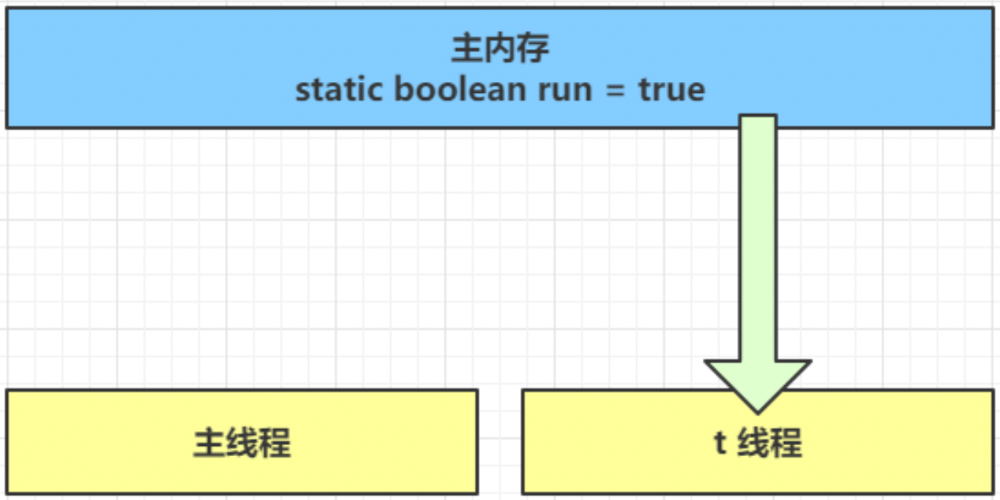
-  因为 t 线程要频繁从主内存中读取 run 的值，JIT 编译器会将 run 的值缓存至自己工作内存中的高速缓存中， 减少对主存中 run 的访问，提高效率
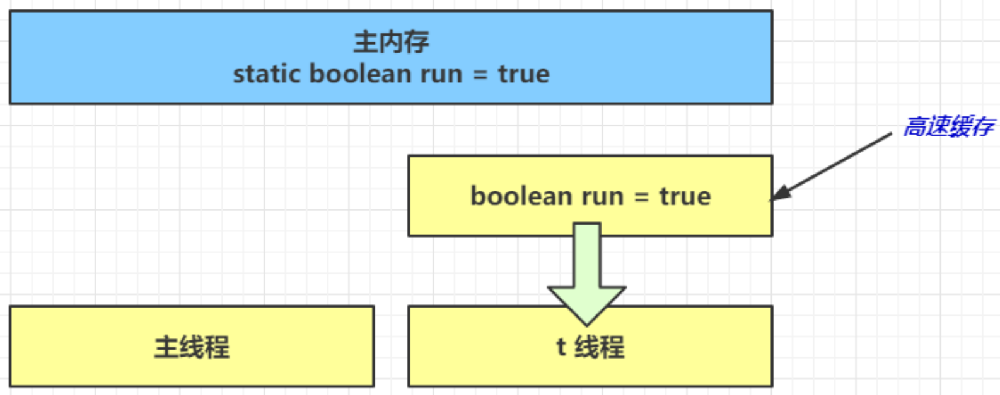
- 1 秒之后，main 线程修改了 run 的值，并同步至主存，而 t 是从自己工作内存中的高速缓存中读取这个变量 的值，结果仍然是旧值
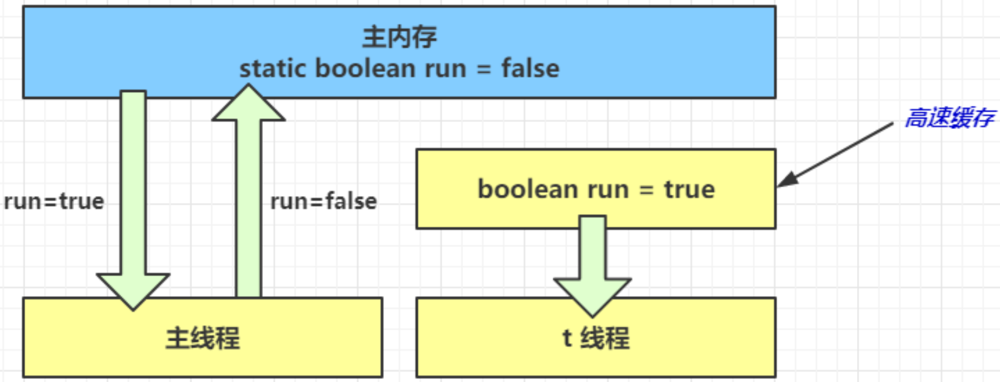
- 解决方法: 使用 volatile(易变关键字)
volatile 可以用来修饰成员变量和静态成员变量，当 volatile变量 发生修改后会立马同步到主存，同时其他线程对该变量的缓存会失效，下次使用时必须从主存中重新加载该变量的值
- 也可使用 synchronized 保证变量的可见性，但是 synchronized 更重量级一些，影响性能
```java
static boolean run = true;

final static Object lock = new Object(); // 用作锁

public static void main(String[] args) throws InterruptedException { 
    Thread t = new Thread(()->{

        synchronized(lock) {
            while(run){ 
                // ....
            } 
        }

    });
    t.start();

    sleep(1);

    synchronized(lock) {
        run = false;
    }
```

### 可见性 VS 原子性
前面例子体现的实际就是可见性，它保证的是在多个线程之间，一个线程对 volatile 变量的修改对另一个线程可见
但是 **volatile 不能保证原子性，其仅适用在一个写线程，多个读线程的情况**: 上例从字节码理解是这样的:
```java
getstatic run // 线程 t 获取 run true
getstatic run // 线程 t 获取 run true
getstatic run // 线程 t 获取 run true
getstatic run // 线程 t 获取 run true
putstatic run // 线程 main 修改 run 为 false， 仅此一次 
getstatic run // 线程 t 获取 run false
```
看下下面的例子: 两个线程一个 i++ 一个 i-- ，只能保证看到最新值，不能解决指令交错
```java
 // 假设i的初始值为0
getstatic i  // 线程2-获取静态变量i的值 线程内i=0

// 发生了线程切换

getstatic i  // 线程1-获取静态变量i的值 线程内i=0
iconst_1  // 线程1-准备常量1
iadd  // 线程1-自增 线程内i=1
putstatic i  // 线程1-将修改后的值存入静态变量i 静态变量i=1

// 发生了线程切换

iconst_1  // 线程2-准备常量1
isub  // 线程2-自减 线程内i=-1
putstatic  i  // 线程2-将修改后的值存入静态变量i 静态变量i=-1
```
- 注意 synchronized 语句块既可以保证代码块的原子性，也同时保证代码块内变量的可见性。但缺点是 synchronized 是属于重量级操作，性能相对更低
- 如果在前面示例的死循环中加入 System.out.println(run) 会发现即使不加 volatile 修饰符，线程 t 也能正确看到 对 run 变量的修改了，想一想为什么? 因为 System.out.println() 中使用了 synchronized, synchronized 会保证对临界区中涉及的变量的修改的可见性和原子性。

### 有序性
JVM 会在不影响正确性的前提下，可以调整语句的执行顺序，思考下面一段代码:
```java
static int i;
static int j;

 // 在某个线程内执行如下赋值操作
i = ...;
j = ...;
```
可以看到，至于是先执行 i 还是 先执行 j ，对最终的结果不会产生影响。所以，上面代码真正执行时，既可以是:
```java
i = ...;
j = ...;
```
也可以是:
```java
j = ...;
i = ...;
```
这种特性称之为『指令重排』，多线程下『指令重排』会影响正确性。为什么要有重排指令这项优化呢?从 CPU 执行指令的原理来理解一下吧.

#### 原理之指令级并行
诡异的结果
```java
int num = 0;
boolean ready = false;

// 线程1 执行此方法
public void actor1(I_Result r) {
    if(ready) {
        r.r1 = num + num;
    } else {
         r.r1 = 1;
    } 
}

// 线程2 执行此方法
public void actor2(I_Result r) {
    num = 2;
    ready = true; 
}
```
I_Result 是一个对象，有一个属性 r1 用来保存结果，问，可能的结果有几种?
有同学这么分析:
- 情况1:线程1 先执行，这时 ready = false，所以进入 else 分支结果为 1
- 情况2:线程2 先执行 num = 2，但没来得及执行 ready = true，线程1 执行，还是进入 else 分支，结果为1 
- 情况3:线程2 执行到 ready = true，线程1 执行，这回进入 if 分支，结果为 4(因为 num 已经执行过了)

但我告诉你，结果还有可能是 0 😁😁😁，信不信吧!
这种情况下是:线程2 执行 ready = true，切换到线程1，进入 if 分支，相加为 0，再切回线程2 执行 num = 2 相信很多人已经晕了 😵😵😵
这种现象叫做指令重排，是 JIT 编译器在运行时的一些优化

## volatile 原理
### 如何保证【可见性】
- 写屏障: 保证在对 volatile 变量赋值之前，对共享变量（不限于volatile变量，包括所有在修改volatile变量语句前所使用的变量）的改动都同步到了主存中。
```java
int num = 0;
boolean ready = false;

public void demo1() {
    num = 2;
    // 写屏障
    ready = ture;  // 给volatile修饰的ready赋值带写屏障，此时num的值已经同步到了主存中
}
```
- 读屏障: 保证volatile语句之后，对共享变量的读取，都是读取的主存中的值。
```java
int num = 0;
boolean ready = false;

// 读屏障
// 从ready中读取值, 会增加读屏障
if(ready) {
    r.r1 = num + num;  // num是从主存中新取的值，而不是之前工作内存或者缓存中的值
} else {
    r.r1 = 2;
}
```
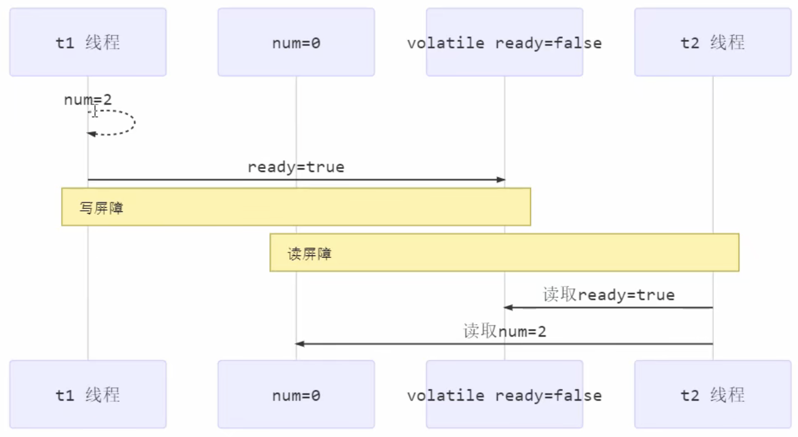

### 如何保证【有序性】
- 写屏障: 写屏障会保证在指令重排序时，不会将写屏障之前代码排在写屏障之后
- 读屏障: 读屏障会保证在指令重排序时，不会将读屏障之后代码排在写屏障之前

### volatile 不能保证【原子性】
volatile 不能保证指令交错
- 写屏障只能保证之后读指令能够读到最新的值，但不能保证读操作跑到写的前面去
- 而有序性也只是保证本线程内相关代码不会被重排序
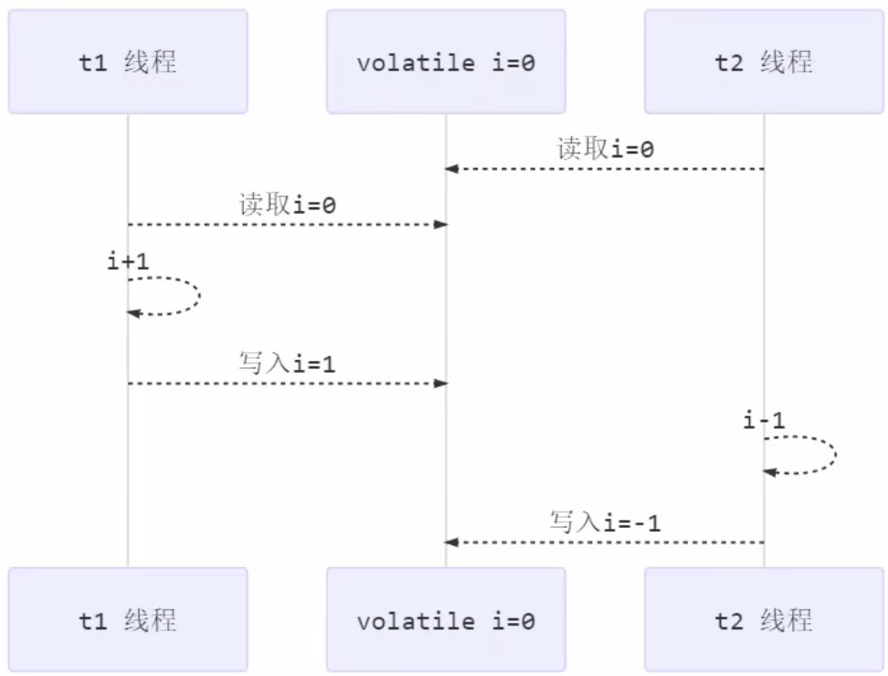

**解决方法**
volatile 修饰的变量ready; volatile boolean ready = false;

### double-checked locking question
以著名的 double-checked locking 单例模式为例:
```java
class DoubleCheckDemo {

    private static DoubleCheckDemo INSTANCE = null;

    public static DoubleCheckDemo singleton() {

        if(INSTANCE == null) {
            // 首次访问时会同步，而之后不会
            synchronized(DoubleCheckDemo.class) {
                if(INSTANCE == null) {
                    INSTANCE = new DoubleCheckDemo();
                }
            }
        }

        return INSTANCE;
    }

}
```
以上实现的特点:
- 懒惰实例化
- 首次使用 singleton() 才会使用 synchronized 加锁，后续使用时无需加锁
- 有隐含的，但很隐蔽的一点: 第一个 if 使用了 INSTANCE 变量，在同步块之外
在多线程环境下，上面的代码时有问题的，singleton() 对应的字节码为:
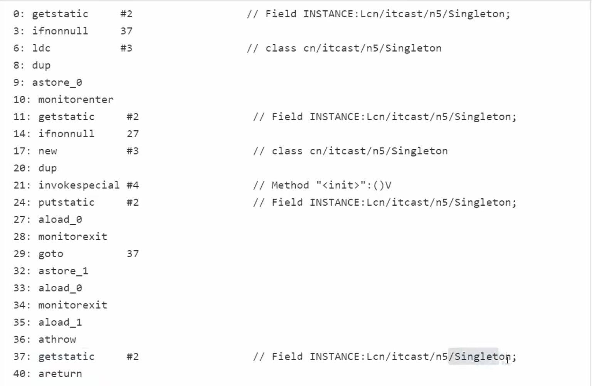
其中:
- 17表示创建对象，将对象引用入栈  // new DoubleCheckDemo()
- 20表示复制一份引用对象  // 引用地址
- 21表示利用一个对象的引用，调用构造方法  // 根据引用地址调用
- 24表示利用一个对象的引用，赋值给static INSTANCE
我们说 synchronized 会保证原子性、有序性、可见性，但是 synchronized 内部是可以重排序的；INSTANCE 在外部引用了，没有完全被 synchronized 所保护。
也许JVM会优化为：先执行24，再执行21，先将创建的对象赋值给INSTANCE，然后再进行初始化。如果两个线程t1、t2按如下时间序列执行:
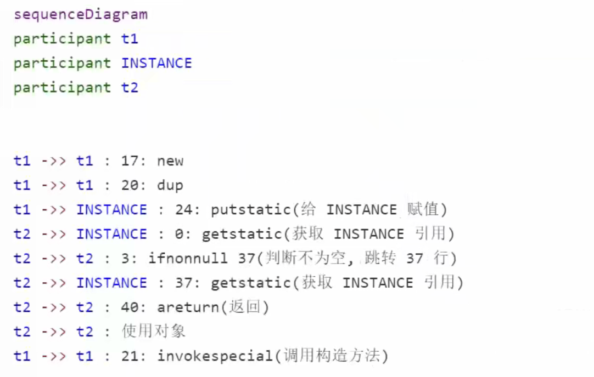
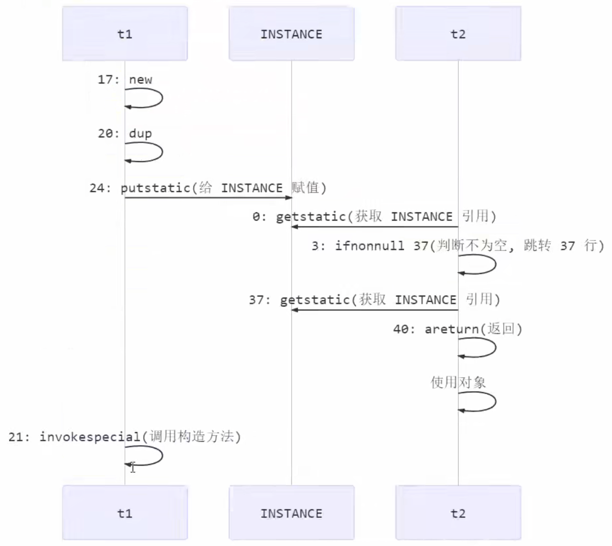
关机在于 0:getstatic 这行代码在 monitor 控制之外，它可以越过 monitor 读取 INSTANCE变量 的值，这时 t1线程 还没有完全将构造方法执行完毕，如果在构造方法中要执行很多初始化操作，那么 t2 线程有可能拿到的将是一个为初始化完毕的对象

**解决办法:** 对 INSTANCE 使用 volatile 修饰即可，可以禁用指令重排。
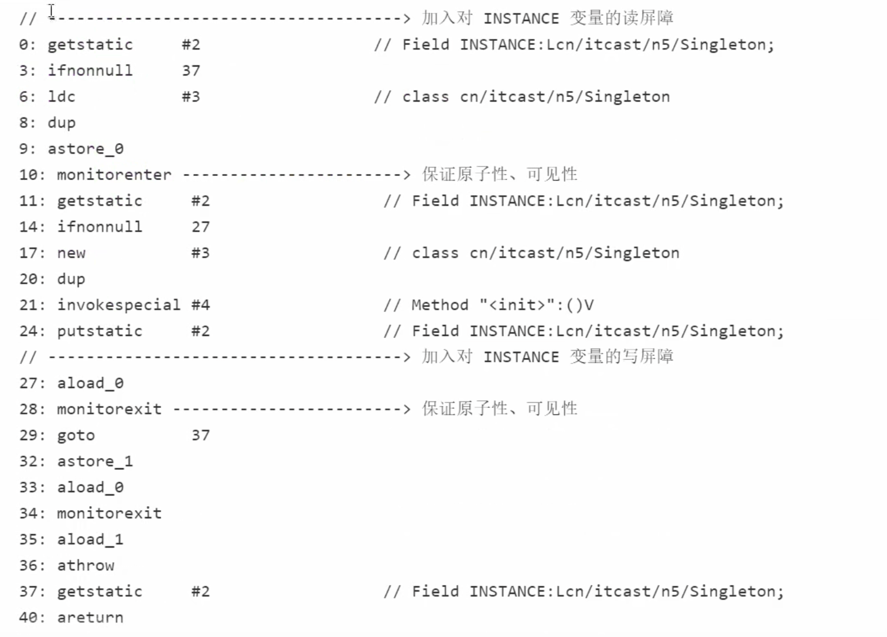
如上面的注释内容所示，读写 volatile 变量时会加入内存屏障，保证一下两点
- 可见性
  - 写屏障保证在该屏障之前的t1对共享变量的改动，都同步到主存中
  - 读屏障保证在该屏障之后t2对共享变量的读取，都是内存中最新的变量
- 有序性
  - 写屏障会保证指令重排序时，不会将屏障之前的代码排在写屏障之后
  - 读屏障会保证指令重排序时，不会将屏障之后的代码排在读屏障之前
- 更底层是在读写变量时，使用lock指令来保证多核cpu之间的有序性和可见性
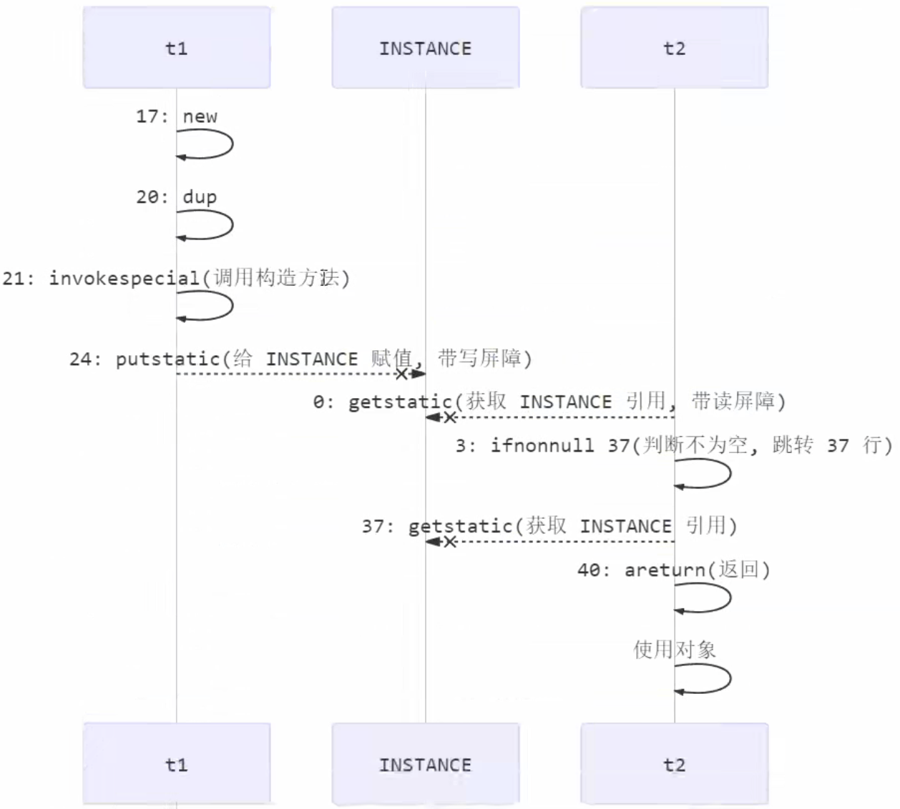
因为屏障的存在，21不会跑到24之后，会保证问题得到解决。

## 无锁并发
CAS适用于线程数比较少的情形（最好不要超过机器的cpu数），因为大量活跃线程盲等占用太多cpu时间
### 原子整数
- AtomicBoolean
- AtomicInteger
- AtomicLong

### 原子引用
原子引用是修改的引用地址，而不是简单的修改引用变量中的属性值
- AtomicReference(value)；感知不到ABA问题
- AtomicMarkableReference(value, mark: boolean)，给原子引用加了一个boolean变量，可做额外标记
- AtomicStampedReference(value, stamp: int)；给原子引用加了一个版本号，可看到被修改过的次数；可防止ABA问题

### 原子数组
不是修改数组的引用，而是修改数组里面的元素
- AtomicIntegerArray
- AtomicLongArray
- AtomicReferenceArray

### 字段更新器
保护对象的成员变量
- AtomicReferenceFieldUpdater
- AtomicIntegerFieldUpdater  字段笔试需整数
- AtomicLongFieldUpdater  字段必须是Long
利用字段更新器，可以针对对象的某个域(Field)进行原子操作，只能配合 volatile 修饰的字段使用，否则会出现如下异常:
```java
Exception in thread "main" java.lang.IllegalArgumentException: Must be volatile type
```

### 原子累加器
性能要比AtomicLong要高点。
性能提升的原因很简单，就是在有竞争时，设置多个累加单元，Therad-0 累加 Cell[0]，而 Thread-1 累加 Cell[1]... 最后将结果汇总。
这样它们在累加时操作的不同的 Cell 变量，因此减少了 CAS 重试失败，从而提高性 能。
- LongAdder
- LongAccumulator
- DoubleAdder
- DoubleAccumulator

## 享元模式
想解决的问题：希望可以共享一些对象，但是实现多线程拷贝

### 体现例子
包装类、String、BigDecimal、BigInteger都是不可变类型，是类型安全的
### 包装类
在JDK的Boolean、Byte、Short、Integer、Long、Character等包装类提供了 valueOf() 方法。
例如 Long 的 valueOf() 会换成 -128~127 之间的Long对象，在这个范围之内会重用对象，超出这个范围才会新建Long对象。
```java
public static Long valueOf(long l) {
    final int offset = 128;
    if (l >= -128 && l <= 127) { // will cache
        return LongCache.cache[(int)l + offset];
    }
    return new Long(l);
}

// 注意:
// Byte、Short、Long 的缓存范围都是-128~127
// Character 的缓存范围都是0~127
// Integer 的默认缓存范围都是-128~127，最小值不能变，但最大值可以通过调整虚拟机的参数 -Djava.lang.Integer.IntegerCache.high来改变
// Boolean 缓存了 true 和 false
```

### String串池

### BigDecimal、BigInteger

## 线程池
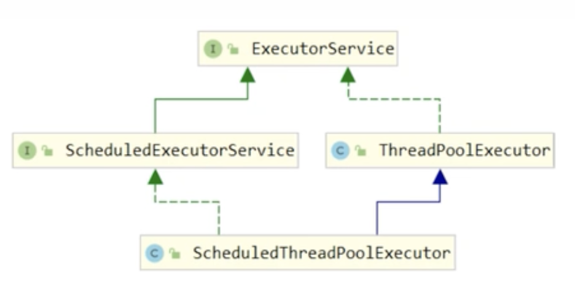

### ThreadPoolExecutor
1) 线程池状态
ThreadPoolExecutor 使用 int 的高 3 位来表示线程池状态，低 29 位表示线程数量
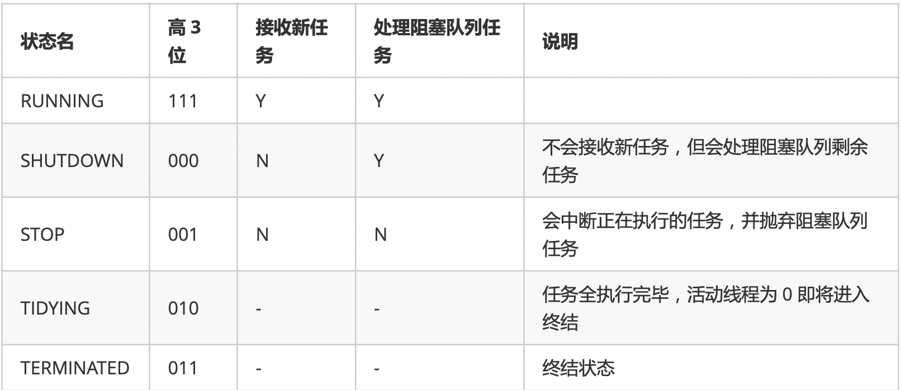
从数字上比较，TERMINATED > TIDYING > STOP > SHUTDOWN > RUNNING
这些信息存储在一个原子变量 ctl 中，目的是将线程池状态与线程个数合二为一，这样就可以用一次 cas 原子操作进行赋值
```java
// c 为旧值， ctlOf 返回结果为新值
ctl.compareAndSet(c, ctlOf(targetState, workerCountOf(c))));

// rs 为高 3 位代表线程池状态， wc 为低 29 位代表线程个数，ctl 是合并它们 
private static int ctlOf(int rs, int wc) { return rs | wc; }
```

2) 构造方法
```java
public ThreadPoolExecutor(
    int corePoolSize,  // 核心线程数目 (最多保留的线程数)
    int maximumPoolSize,  // 最大线程数目，核心线程数目 + 救急线程数目
    long keepAliveTime,  // 生存时间 - 针对救急线程
    TimeUnit unit,  // 针对救急线程
    BlockingQueue<Runnable> workQueue,  // 阻塞队列
    ThreadFactory threadFactory,  // 线程工厂 - 可以为线程创建时起个好名字
    RejectedExecutionHandler handler  //  拒绝策略
)
```
工作方式:
- 线程池中刚开始没有线程，当一个任务提交给线程池后，线程池会创建一个新线程来执行任务。
- 当线程数达到 corePoolSize 并没有线程空闲，这时再加入任务，新加的任务会被加入workQueue 队列排队，直到有空闲的线程。
- 如果队列选择了有界队列，那么任务超过了队列大小时，会创建 maximumPoolSize - corePoolSize 数目的线程来救急。
- 如果线程到达 maximumPoolSize 仍然有新任务这时会执行拒绝策略。拒绝策略 jdk 提供了 4 种实现，其它著名框架也提供了实现
    - AbortPolicy 让调用者抛出 RejectedExecutionException 异常，这是默认策略
    - CallerRunsPolicy 让调用者运行任务
    - DiscardPolicy 放弃本次任务
    - DiscardOldestPolicy 放弃队列中最早的任务，本任务取而代之
    - Dubbo 的实现，在抛出 RejectedExecutionException 异常之前会记录日志，并 dump 线程栈信息，方便定位问题
    - Netty 的实现，是创建一个新线程来执行任务
    - ActiveMQ 的实现，带超时等待(60s)尝试放入队列
    - PinPoint 的实现，它使用了一个拒绝策略链，会逐一尝试策略链中每种拒绝策略
    - 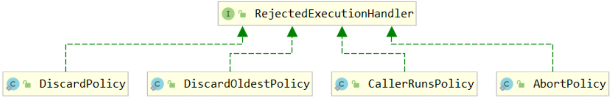
- 当高峰过去后，超过corePoolSize 的救急线程如果一段时间没有任务做，需要结束节省资源，这个时间由 keepAliveTime 和 unit 来控制。

根据这个构造方法，JDK Executors 类中提供了众多工厂方法来创建各种用途的线程池。

3) newFixedThreadPool
```java
public static ExecutorService newFixedThreadPool(int nThreads, ThreadFactory threadFactory) {
    return new ThreadPoolExecutor(nThreads, nThreads,
                                  0L, TimeUnit.MILLISECONDS,
                                  new LinkedBlockingQueue<Runnable>(),
                                  threadFactory);
}
```
特点:
- 核心线程数 == 最大线程数(没有救急线程被创建)，因此也无需超时时间
- 阻塞队列是无界的，可以放任意数量的任务
- 适用于任务量已知，相对耗时的任务

4) newCachedThreadPool
```java
public static ExecutorService newCachedThreadPool() {
    return new ThreadPoolExecutor(0, Integer.MAX_VALUE,
                                  60L, TimeUnit.SECONDS,
                                  new SynchronousQueue<Runnable>());
}
```
特点:
- 核心线程数是 0， 最大线程数是 Integer.MAX_VALUE，救急线程的空闲生存时间是 60s，意味着
  - 全部都是救急线程(60s 后可以回收)
  - 救急线程可以无限创建
- 队列采用了 SynchronousQueue 实现特点是，它没有容量，每次插入数据时若无线程来取走，就会被阻塞
```java
SynchronousQueue<Integer> queue = new SynchronousQueue<>();

queue.put(1); // 若 1 没被取走，后续无法往里面存放数据

System.out.println("数据1被取走");  // 没执行到

queue.put(2);
```
- 整个线程池表现为线程数会根据任务量不断增长，没有上限，当任务执行完毕，空闲1分钟后释放线程。适合任务数比较密集，但每个任务执行时间较短的情况。

5) newSingleThreadExecutor
```java
public static ExecutorService newSingleThreadExecutor() {
    return new FinalizableDelegatedExecutorService
        (new ThreadPoolExecutor(1, 1,
                                0L, TimeUnit.MILLISECONDS,
                                new LinkedBlockingQueue<Runnable>()));
}
```
使用场景:
希望多个任务排队执行。线程数固定为 1，任务数多于 1 时，会放入无界队列排队。任务执行完毕，这唯一的线程也不会被释放。
区别:
- 自己创建一个单线程串行执行任务，如果任务执行失败而终止那么没有任何补救措施。而线程池中的一个任务失败了，还会新建一个线程，保证池的正常工作，不影响其他任务执行。
- Executors.newSingleThreadExecutor() 线程个数始终为1，不能修改。FinalizableDelegatedExecutorService 应用的是装饰器模式，只对外暴露了 ExecutorService 接口，因
  此不能调用 ThreadPoolExecutor 中特有的方法
- Executors.newFixedThreadPool(1) 初始时为1，以后还可以修改。对外暴露的是 ThreadPoolExecutor 对象，可以强转后调用 setCorePoolSize 等方法进行修改。


## 其他记录

### main线程挂了，其他线程还能存活吗？
main线程结束后，创建的子线程仍然可以存活。主线程，只是个普通的非守护线程，用来启动应用程序，不能设置成守护线程；除此之外，它跟其他非守护线程没有什么不同。主线程执行结束，其他线程一样可以正常执行。 java虚拟机(相当于进程)退出的时机是：虚拟机中所有存活的线程都是守护线程。只要还有存活的非守护线程虚拟机就不会退出，而是等待非守护线程执行完毕；反之，如果虚拟机中的线程都是守护线程，那么不管这些线程的死活java虚拟机都会退出。

### 为什么线程切换笔进程切换代价低？TLB？
TODO: 待续

### private和final可以增强线程的安全性

### 单个Synchronized方法是线程安全的，但是多个Synchronized的方法的组合不见得安全

### lambda表达式中不能有private变量？

### 装饰器模式