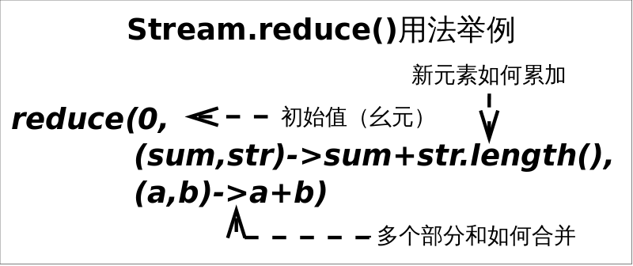

# stream

## stream简介
stream是Java函数式编程的主角。
对于Java 7来说stream完全是个陌生东西，stream并不是某种数据结构，它只是数据源的一种视图。这里的数据源可以是一个数组，Java容器或I/O channel等。
正因如此要得到一个stream通常不会手动创建，而是调用对应的工具方法，比如：
- 调用Collection.stream()或者Collection.parallelStream()方法
- 调用Arrays.stream(T[] array)方法

虽然大部分情况下stream是容器调用Collection.stream()方法得到的，但stream和collections有以下不同：

- 无存储。stream不是一种数据结构，它只是某种数据源的一个视图，数据源可以是一个数组，Java容器或I/O channel等。
- 为函数式编程而生。对stream的任何修改都不会修改背后的数据源，比如对stream执行过滤操作并不会删除被过滤的元素，而是会产生一个不包含被过滤元素的新stream。
- 惰式执行。stream上的操作并不会立即执行，只有等到用户真正需要结果的时候才会执行。
- 可消费性。stream只能被“消费”一次，一旦遍历过就会失效，就像容器的迭代器那样，想要再次遍历必须重新生成。

对stream的操作分为为两类，中间操作(intermediate operations)和结束操作(terminal operations)，二者特点是：
- 中间操作总是会惰式执行，调用中间操作只会生成一个标记了该操作的新stream，仅此而已。
- 结束操作会触发实际计算，计算发生时会把所有中间操作积攒的操作以pipeline的方式执行，这样可以减少迭代次数。计算完成之后stream就会失效。

## reduce api

reduce操作可以实现从一组元素中生成一个值，sum()、max()、min()、count()等都是reduce操作，将他们单独设为函数只是因为常用。reduce()的方法定义有三种重写形式：

- Optional<T> reduce(BinaryOperator<T> accumulator)
- T reduce(T identity, BinaryOperator<T> accumulator)
- <U> U reduce(U identity, BiFunction<U,? super T,U> accumulator, BinaryOperator<U> combiner)

虽然函数定义越来越长，但语义不曾改变，多的参数只是为了指明初始值（参数identity），或者是指定并行执行时多个部分结果的合并方式（参数combiner）。
reduce()最常用的场景就是从一堆值中生成一个值。用这么复杂的函数去求一个最大或最小值，你是不是觉得设计者有病。
其实不然，因为“大”和“小”或者“求和”有时会有不同的语义。

需求：从一组单词中找出最长的单词。这里“大”的含义就是“长”。
```java
// 找出最长的单词
Stream<String> stream = Stream.of("I", "love", "you", "too");
Optional<String> longest = stream.reduce((s1, s2) -> s1.length() >= s2.length() ? s1 : s2);
// Optional<String> longest = stream.max((s1, s2) -> s1.length()-s2.length());
System.out.println(longest.get());
```
上述代码会选出最长的单词love，其中Optional是（一个）值的容器，使用它可以避免null值的麻烦。
当然可以使用Stream.max(Comparator<? super T> comparator)方法来达到同等效果，但reduce()自有其存在的理由。


需求：求出一组单词的长度之和。这是个“求和”操作，操作对象输入类型是String，而结果类型是Integer。
```java
Stream<String> stream = Stream.of("I", "love", "you", "too");
int len = stream.reduce(
    0,  // 初始值　// (1)
    (sum, str) -> sum += str.length(),  // 累加器 // (2)
    (a, b) -> a + b  // 部分和拼接器，并行执行时才会用到 // (3)
);
// int lengthSum = stream.mapToInt(str -> str.length()).sum();
System.out.println(len);
```
上述代码标号(2)处将i. 字符串映射成长度，ii. 并和当前累加和相加。
这显然是两步操作，使用reduce()函数将这两步合二为一，更有助于提升性能。
如果想要使用map()和sum()组合来达到上述目的，也是可以的。

## collect
reduce()擅长的是生成一个值，如果想要从Stream生成一个集合或者Map等复杂的对象该怎么办呢？
终极武器collect()横空出世！

不夸张的讲，如果你发现某个功能在Stream接口中没找到，十有八九可以通过collect()方法实现。
collect()是Stream接口方法中最灵活的一个，学会它才算真正入门Java函数式编程。先看几个热身的小例子：

```java
/**
 * 将Stream转换成容器或Map
 */
public static void collectExample() {
  Stream<String> stream1 = Stream.of("I", "love", "you", "too");
  List<String> list = stream1.collect(Collectors.toList());  // (1)
  list.forEach(System.out::println);

  // 注意不能在复用上面的stream1，stream用过一次终止函数后便失效了
  Stream<String> stream2 = Stream.of("I", "love", "you", "too");
  Map<String, Integer> map = stream2.collect(Collectors.toMap(Function.identity(), String::length));  // (2)
  // 提示：map和set的输出，不保证维持元素加入的顺序
  map.forEach((k, v) -> System.out.println(k + ": " + v));

  Stream<String> stream3 = Stream.of("I", "love", "you", "too");
  Set<String> set = stream3.collect(Collectors.toSet());  // (3)
  set.forEach(System.out::println);
}
```

