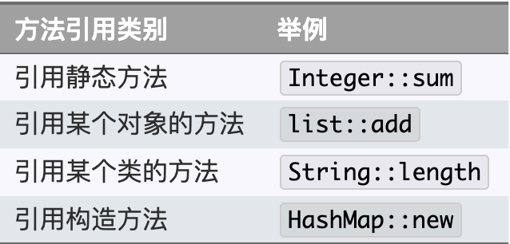

# stream

## stream简介
stream是Java函数式编程的主角。
对于Java 7来说stream完全是个陌生东西，stream并不是某种数据结构，它只是数据源的一种视图。这里的数据源可以是一个数组，Java容器或I/O channel等。
正因如此要得到一个stream通常不会手动创建，而是调用对应的工具方法，比如：
- 调用Collection.stream()或者Collection.parallelStream()方法
- 调用Arrays.stream(T[] array)方法

虽然大部分情况下stream是容器调用Collection.stream()方法得到的，但stream和collections有以下不同：

- 无存储。stream不是一种数据结构，它只是某种数据源的一个视图，数据源可以是一个数组，Java容器或I/O channel等。
- 为函数式编程而生。对stream的任何修改都不会修改背后的数据源，比如对stream执行过滤操作并不会删除被过滤的元素，而是会产生一个不包含被过滤元素的新stream。
- 惰式执行。stream上的操作并不会立即执行，只有等到用户真正需要结果的时候才会执行。
- 可消费性。stream只能被“消费”一次，一旦遍历过就会失效，就像容器的迭代器那样，想要再次遍历必须重新生成。

对stream的操作分为为两类，中间操作(intermediate operations)和结束操作(terminal operations)，二者特点是：
- 中间操作总是会惰式执行，调用中间操作只会生成一个标记了该操作的新stream，仅此而已。
- 结束操作会触发实际计算，计算发生时会把所有中间操作积攒的操作以pipeline的方式执行，这样可以减少迭代次数。计算完成之后stream就会失效。

## reduce api

reduce操作可以实现从一组元素中生成一个值，sum()、max()、min()、count()等都是reduce操作，将他们单独设为函数只是因为常用。reduce()的方法定义有三种重写形式：

- Optional<T> reduce(BinaryOperator<T> accumulator)
- T reduce(T identity, BinaryOperator<T> accumulator)
- <U> U reduce(U identity, BiFunction<U,? super T,U> accumulator, BinaryOperator<U> combiner)

虽然函数定义越来越长，但语义不曾改变，多的参数只是为了指明初始值（参数identity），或者是指定并行执行时多个部分结果的合并方式（参数combiner）。
reduce()最常用的场景就是从一堆值中生成一个值。用这么复杂的函数去求一个最大或最小值，你是不是觉得设计者有病。
其实不然，因为“大”和“小”或者“求和”有时会有不同的语义。

需求：从一组单词中找出最长的单词。这里“大”的含义就是“长”。
```java
// 找出最长的单词
Stream<String> stream = Stream.of("I", "love", "you", "too");
Optional<String> longest = stream.reduce((s1, s2) -> s1.length() >= s2.length() ? s1 : s2);
// Optional<String> longest = stream.max((s1, s2) -> s1.length()-s2.length());
System.out.println(longest.get());
```
上述代码会选出最长的单词love，其中Optional是（一个）值的容器，使用它可以避免null值的麻烦。
当然可以使用Stream.max(Comparator<? super T> comparator)方法来达到同等效果，但reduce()自有其存在的理由。


需求：求出一组单词的长度之和。这是个“求和”操作，操作对象输入类型是String，而结果类型是Integer。
```java
Stream<String> stream = Stream.of("I", "love", "you", "too");
int len = stream.reduce(
    0,  // 初始值　// (1)
    (sum, str) -> sum += str.length(),  // 累加器 // (2)
    (a, b) -> a + b  // 部分和拼接器，并行执行时才会用到 // (3)
);
// int lengthSum = stream.mapToInt(str -> str.length()).sum();
System.out.println(len);
```
上述代码标号(2)处将i. 字符串映射成长度，ii. 并和当前累加和相加。
这显然是两步操作，使用reduce()函数将这两步合二为一，更有助于提升性能。
如果想要使用map()和sum()组合来达到上述目的，也是可以的。

## collect
reduce()擅长的是生成一个值，如果想要从Stream生成一个集合或者Map等复杂的对象该怎么办呢？
终极武器collect()横空出世！

不夸张的讲，如果你发现某个功能在Stream接口中没找到，十有八九可以通过collect()方法实现。
collect()是Stream接口方法中最灵活的一个，学会它才算真正入门Java函数式编程。先看几个热身的小例子：

```java
/**
 * 将Stream转换成容器或Map
 */
public static void collectExample() {
  Stream<String> stream1 = Stream.of("I", "love", "you", "too");
  List<String> list = stream1.collect(Collectors.toList());  // (1)
  list.forEach(System.out::println);

  // 注意不能在复用上面的stream1，stream用过一次终止函数后便失效了
  Stream<String> stream2 = Stream.of("I", "love", "you", "too");
  Map<String, Integer> map = stream2.collect(Collectors.toMap(Function.identity(), String::length));  // (2)
  // 提示：map和set的输出，不保证维持元素加入的顺序
  map.forEach((k, v) -> System.out.println(k + ": " + v));

  Stream<String> stream3 = Stream.of("I", "love", "you", "too");
  Set<String> set = stream3.collect(Collectors.toSet());  // (3)
  set.forEach(System.out::println);
}
```
## 接口的静态方法和默认方法
Function是一个接口，那么Function.identity()是什么意思呢？这要从两方面解释：
- Java 8允许在接口中加入具体方法。接口中的具体方法有两种，default方法和static方法，identity()就是Function接口的一个静态方法。
- Function.identity()返回一个输出跟输入一样的Lambda表达式对象，等价于形如t -> t形式的Lambda表达式。
上面的解释是不是让你疑问更多？不要问我为什么接口中可以有具体方法，也不要告诉我你觉得t -> t比identity()方法更直观。
我会告诉你接口中的default方法是一个无奈之举，在Java 7及之前要想在定义好的接口中加入新的抽象方法是很困难甚至不可能的，
因为所有实现了该接口的类都要重新实现。试想在Collection接口中加入一个stream()抽象方法会怎样？
default方法就是用来解决这个尴尬问题的，直接在接口中实现新加入的方法。
既然已经引入了default方法，为何不再加入static方法来避免专门的工具类呢

## 方法引用
诸如`String::length`的语法形式叫做方法引用（method references），这种语法用来替代某些特定形式Lambda表达式。
如果Lambda表达式的全部内容就是调用一个已有的方法，那么可以用方法引用来替代Lambda表达式。方法引用可以细分为四类：


## 收集器

收集器（Collector）是为Stream.collect()方法量身打造的工具接口（类）。
考虑一下将一个Stream转换成一个容器（或者Map）需要做哪些工作？我们至少需要知道：
- 目标容器是什么？是ArrayList还是HashSet，或者是个TreeMap。
- 新元素如何添加到容器中？是List.add()还是Map.put()。
- 另外如果并行的进行规约，还需要告诉collect() 多个部分结果如何合并成一个。

结合以上分析，collect()方法定义为<R> R collect(Supplier<R> supplier, BiConsumer<R,? super T> accumulator, BiConsumer<R,R> combiner)
三个参数依次对应上述三条分析。不过每次调用collect()都要传入这三个参数太麻烦，收集器Collector就是对这三个参数的简单封装,
所以collect()的另一定义为<R,A> R collect(Collector<? super T,A,R> collector)。
Collectors工具类可通过静态方法生成各种常用的Collector。举例来说，如果要将Stream规约成List可以通过如下两种方式实现：
```java
//　将Stream规约成List
Stream<String> stream = Stream.of("I", "love", "you", "too");
List<String> list = stream.collect(ArrayList::new, ArrayList::add, ArrayList::addAll);// 方式１
//List<String> list = stream.collect(Collectors.toList());// 方式2
System.out.println(list);
```
通常情况下我们不需要手动指定collect()的三个参数，而是调用collect(Collector<? super T,A,R> collector)方法，
并且参数中的Collector对象大都是直接通过Collectors工具类获得。实际上传入的收集器的行为决定了collect()的行为。

### 使用collect()生成Collection
前面已经提到通过collect()方法将Stream转换成容器的方法，这里再汇总一下。
将Stream转换成List或Set是比较常见的操作，所以Collectors工具已经为我们提供了对应的收集器，通过如下代码即可完成：
```java
// 将Stream转换成List或Set
Stream<String> stream = Stream.of("I", "love", "you", "too");
List<String> list = stream.collect(Collectors.toList()); // (1)
Set<String> set = stream.collect(Collectors.toSet()); // (2)
```
上述代码能够满足大部分需求，但由于返回结果是接口类型，我们并不知道类库实际选择的容器类型是什么，
有时候我们可能会想要人为指定容器的实际类型，这个需求可通过Collectors.toCollection(Supplier<C> collectionFactory)方法完成。
```java
// 使用toCollection()指定规约容器的类型
ArrayList<String> arrayList = stream.collect(Collectors.toCollection(ArrayList::new));// (3)
HashSet<String> hashSet = stream.collect(Collectors.toCollection(HashSet::new));// (4)
```